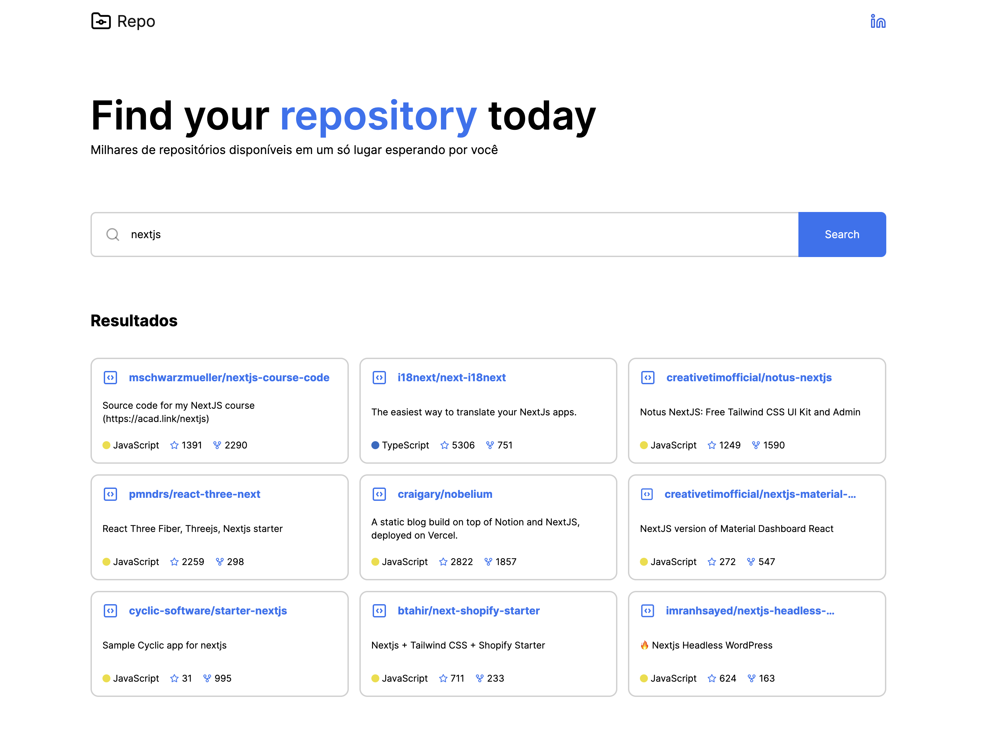

<h1 align="center">
    
</h1>

# GraphQL Github API

Projeto proposto originalmente como desafio técnico para uma vaga de front-end. A aplicação consiste em estebelcer conexão com a GraphQL Github API e fazer a busca por repositórios.

## Tech Stack

## Demo

- [Live](https://github-graphql-five.vercel.app/)

## Getting Started

1. **Clone project**: `git clone git@github.com:d0ugui/github-graphql.git`
2. **Install dependencies**: `npm install or yarn`
3. **Create .env.local following the .env.example file**
4. **Run front-end**: `npm run dev or yarn dev`

## License

This software is available under the following licenses:

- [MIT](https://rem.mit-license.org)
